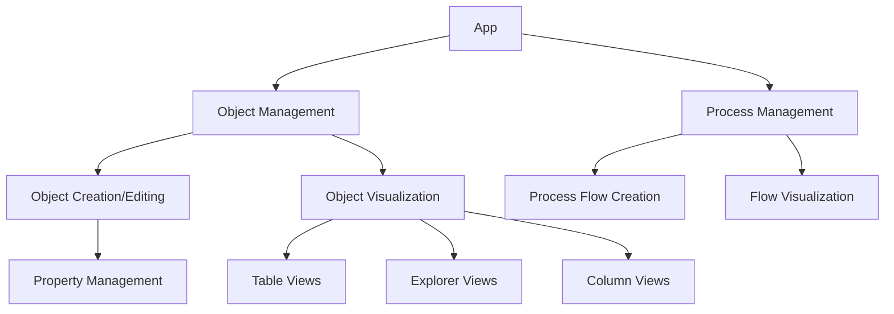
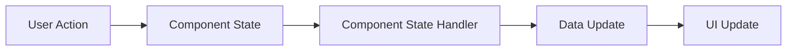
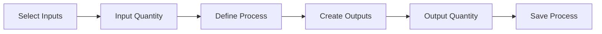

# System Patterns

## Architecture Overview

The IoB application follows a component-based architecture with a focus on reusability and modularity. The core system is built around a flexible object model that supports hierarchical structures and process flows.



## Core Design Patterns

### Object Model

The application uses a UUID-based object model with extensible properties:

```typescript
interface IoObject {
  uuid: string
  name: string
  type?: string
  properties: Property[]
  children?: IoObject[]
  files?: File[]
  createdAt: string
  updatedAt: string
}

interface Property {
  uuid: string
  key: string
  value?: string
  values?: PropertyValue[]
  files?: File[]
}

interface PropertyValue {
  uuid: string
  value: string
  files?: File[]
}
```

### Process Flow Model

Processes connect objects through input/output relationships:

```typescript
interface Process {
  uuid: string
  name: string
  inputs: ProcessMaterial[]
  outputs: ProcessMaterial[]
  properties: Property[]
  createdAt: string
  updatedAt: string
}

interface ProcessMaterial {
  id: string // References object UUID
  name: string
  quantity: number
  unit: string
  process?: string
}
```

## Component Organization

The application follows a structured component organization:

```
src/
├── app/               # Next.js pages and routing
├── components/        # Reusable UI components
│   ├── forms/         # Form components
│   ├── modals/        # Modal dialogs
│   ├── object-views/  # Object visualization views
│   ├── sheets/        # Slide-in sheet components
│   ├── tables/        # Table components
│   └── ui/            # Base UI components
├── contexts/          # React context providers
├── hooks/             # Custom React hooks
├── lib/               # Utility functions and data
└── types/             # TypeScript type definitions
```

## Key Technical Decisions

1. **Component Reusability**: Using consistent sheets and modals for object interaction
2. **UI Component Structure**: Centralizing UI components with index.ts exports
3. **Material Flow Tracking**: Implementing input/output relationships with quantity tracking
4. **Object Management**: Consistent CRUD operations across different views
5. **Visual Hierarchies**: Multiple view types (table, explorer, columns) for object visualization

## Data Flow Patterns

### Object Management Flow



### Process Creation Flow



## View Patterns

1. **Table Views**: For dense information display with row actions
2. **Explorer Views**: For hierarchical object navigation
3. **Column Views**: For Kanban-style workflow visualization
4. **Sheets**: For detailed object viewing and editing
5. **Modals**: For confirmations and quick actions

## State Management

The application uses React's built-in state management with hooks:

1. **Component State**: useState for local component state
2. **Context API**: For sharing state between related components
3. **Props Drilling**: For passing data and handlers down the component tree

## UI/UX Patterns

1. **Consistent Actions**: Edit/View/Delete actions appear in the same position across views
2. **Sheet-Based Editing**: Slide-in sheets for detailed object editing
3. **Dropdown Actions**: Dropdown menus for row-level actions in tables
4. **Templates**: Quick templates for common material types
5. **Progressive Disclosure**: Complex features revealed progressively in the interface
