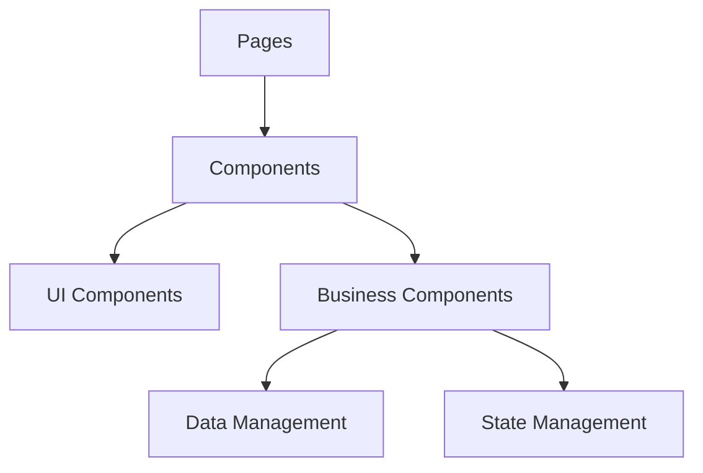

# System Patterns

## Architecture Overview

The application follows a modern React-based architecture with Next.js:



## Key Technical Decisions

1. Frontend Framework

   - Next.js for server-side rendering and routing
   - React for component-based architecture
   - TypeScript for type safety

2. UI Framework

   - Tailwind CSS for styling
   - Radix UI for accessible components
   - Custom component library

3. State Management

   - React's built-in state management
   - Local component state
   - Context API for global state

4. Project Structure
   - Source code in `src` directory
   - Path aliases for clean imports
   - Feature-based organization

## Design Patterns

1. Component Patterns

   - Container/Presenter pattern
   - Compound components
   - Higher-order components

2. Data Patterns

   - Props drilling minimization
   - State lifting
   - Controlled components

3. UI Patterns
   - Modal-based forms
   - Table-based data display
   - Hierarchical navigation

## Component Relationships

1. Object Management

   - ObjectsTable → ObjectDetailsModal
   - ObjectsTable → AddObjectModal
   - ObjectsTable → PropertyDetailsModal

2. Process Management

   - ProcessTable → ProcessDetailsModal
   - ProcessTable → AddMaterialModal
   - ProcessForm → ProcessTable

3. Authentication
   - AuthPage → CertificateSelector
   - CertificateSelector → Certificate Details
   - AuthPage → Help Documentation

## Data Flow

1. Object Flow

   - Object creation/editing
   - Property management
   - Hierarchy navigation

2. Process Flow

   - Process creation/editing
   - Material management
   - Status tracking

3. Authentication Flow
   - Certificate selection
   - mTLS handshake
   - Session management

## File Organization

1. Page Structure

   ```
   src/app/
   ├── page.tsx              # Auth page
   ├── objects/
   │   ├── page.tsx         # Objects list
   │   └── [uuid]/
   │       └── page.tsx     # Object details
   └── help/
       └── page.tsx         # Help documentation
   ```

2. Component Structure

   ```
   src/components/
   ├── ui/                  # Shared UI components
   ├── objects/            # Object-related components
   └── process/           # Process-related components
   ```

3. Utility Structure
   ```
   src/
   ├── lib/               # Shared utilities
   └── hooks/            # Custom React hooks
   ```

## Import Patterns

1. Component Imports

   ```typescript
   import { Button } from '@/components/ui/button'
   import { ObjectsTable } from '@/components/objects-table'
   ```

2. Utility Imports
   ```typescript
   import { formatDate } from '@/lib/utils'
   import { useAuth } from '@/hooks/use-auth'
   ```

## Error Handling

1. Authentication Errors

   - Certificate validation failures
   - Session expiration
   - Network issues

2. Data Errors

   - API request failures
   - Validation errors
   - State conflicts

3. UI Error Boundaries
   - Component error catching
   - Fallback UI
   - Error recovery
